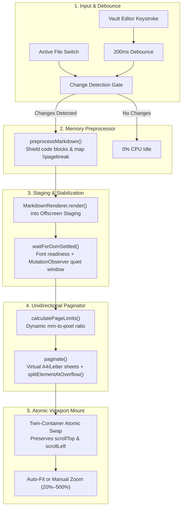

# PDF Studio for Obsidian

> Real-time paginated Markdown preview on virtual sheets (A4, Letter, Legal, A3, A5) with print-faithful typography, intelligent semantic content splitting, and direct vector PDF export.

[](LICENSE)
[](https://obsidian.md)
[](https://www.typescriptlang.org/)
[](https://vitest.dev/)

---

## The Problem & The Solution

Traditional Obsidian PDF preview tools often suffer from structural instabilities when handling complex documents with syntax-highlighted code blocks, mathematical expressions, or third-party DOM enhancements:

- **Destructive DOM Recycling:** Dismantling rendered pages (`restoreFromPages`) breaks nested DOM structures created by syntax enhancers, causing measurement loops and page oscillations (e.g. jumping between 5 and 14 pages).
- **Measurement Jitter:** Measuring elements synchronously before fonts and math formulas settle causes incorrect zero-height measurements.
- **Visual Flicker:** Rebuilding the view in-place results in white flashes while typing.

**PDF Studio** resolves these challenges through a **strict unidirectional, double-buffered pagination pipeline**:

1. **Write-Only Virtual Pages:** Each pagination cycle constructs fresh, ephemeral pages from clean Markdown. Nodes are never recycled or torn down across cycles.
2. **Double-Buffered Atomic Swapping:** Rendering and measurement take place in an off-screen staging container. Virtual sheets are swapped into the viewport atomically, preserving the user's scroll position without flickering.
3. **Event-Driven Stabilization:** An asynchronous stabilization barrier (`waitForDomSettled`) ensures fonts, MathJax formulas, and syntax styles are fully laid out before pagination calculations begin.
4. **Change Detection Gate:** Aborts immediately when text content and page geometry remain unchanged, ensuring 0% CPU consumption during editor idle states.

---

## Architectural Topography



---

## Key Features

- **Standard Paper Formats:** Native support for ISO 216 formats (**A4**, **A3**, **A5**) and ANSI formats (**Letter**, **Legal**).
- **Customizable Margins:** Configurable printable gutters with instant presets (**Normal 20mm**, **Compact 10mm**, **Wide 30mm**).
- **Semantic Overflow Splitting:**
  - **Code Blocks:** Bisected strictly along line breaks (`\n`) with minimum thresholds (3 lines head, 2 lines tail) to prevent orphaned code lines.
  - **Tables:** Split cleanly across table row boundaries (`<tr>`), automatically replicating the `<thead>` column headers on continuation sheets.
  - **Lists:** Ordered lists (`<ol>`) split between items, preserving continuous numbering via `start="N + 1"`.
  - **Headings & Lead-ins:** Enforces _keep-with-next_ heuristics to prevent lonely section titles at the bottom of a page.
- **Double-Buffered Viewport:** Smooth typing experience with zero white flash and persistent scroll tracking.
- **Direct Vector PDF Export:** Generates clean, print-ready PDF files via Chromium's native `printToPDF` engine without heavy binary dependencies.
- **Floating Quick Options:** In-toolbar popover to switch paper dimensions, margins, and auto-zoom with a single click.

---

## Authoring Directives

PDF Studio supports explicit page break directives on standalone lines in your Markdown notes:

```markdown
# Section One

This content appears on the first virtual page.

\pagebreak

# Section Two

This content starts at the top of the next virtual sheet.
```

### Supported Page Break Syntax

- `\pagebreak` (LaTeX / Pandoc standard delimiter)
- `<!-- pagebreak -->` (Standard HTML comment delimiter)
- `//page` (Concise shorthand directive)

> **Safety Invariant:** Directives located inside fenced code blocks (```` or `~~~`) are strictly shielded and will not trigger a page break.

---

## Installation

### Manual Installation

1. Download the latest release assets (`main.js`, `manifest.json`, `styles.css`) from the [Releases](https://github.com/JuanFerber/obsidian-pdf-studio/releases) page.
2. Create a folder named `pdf-studio` in your vault's plugin directory:
   `<VaultFolder>/.obsidian/plugins/pdf-studio/`
3. Copy the release files into that directory.
4. Reload Obsidian, open **Settings $\rightarrow$ Community Plugins**, and enable **PDF Studio**.

---

## Commands & Usage

| Command                                         | Action                                                                         |
| :---------------------------------------------- | :----------------------------------------------------------------------------- |
| **PDF Studio: Open Live Preview**               | Opens or focuses the paginated preview pane in the right workspace leaf.       |
| **PDF Studio: Fit Preview to Half Width (50%)** | Resizes the preview pane to occupy exactly 50% of the active workspace window. |

### Preview Toolbar Controls

- **Page Navigator:** Navigate directly to any page number or enter a specific sheet index.
- **Format & Margin Popover:** Click the options button (`⚙` / sliders) to select paper sizes and margin presets.
- **Zoom Controls:** Switch between **Auto-Fit** (scales dynamically to leaf width) and **Manual Zoom** (20% to 500%).
- **Export to PDF:** Opens the native save dialog to export the document directly to a vector PDF.
- **Reload Preview:** Forces a fresh re-render bypassing the change detection cache.

---

## Development & Verification

### Prerequisites

- [Node.js](https://nodejs.org/) (version 22 or higher recommended)
- [npm](https://www.npmjs.com/)

### Setup & Compilation

```bash
# Clone the repository
git clone https://github.com/JuanFerber/obsidian-pdf-studio.git
cd obsidian-pdf-studio

# Install dependencies
npm install

# Check & format code style
npm run format:check
npm run format

# Run Vitest unit & integration test suite
npm test

# Build production bundle (build/main.js)
npm run build
# Start live incremental compiler for development
npm run dev
```

---

## Repository Structure

```text
├── .github/
│   └── workflows/           # CI and automated release pipelines
├── manifest.json            # Obsidian plugin metadata and minimum app version
├── package.json             # Build toolchain and development scripts
├── tsconfig.json            # TypeScript compiler options (ES2021 / ES2024 lib)
├── vitest.config.mts        # Vitest test runner configuration
├── esbuild.config.mjs       # Bundling pipeline and local vault sync
├── styles.css               # Virtual sheet layout, paper shadows, and print media rules
├── LICENSE                  # MIT License definition
└── src/
    ├── main.ts              # Plugin lifecycle, command registry, and workspace coordinator
    ├── types.ts             # Paper dimensions (ISO/ANSI), margins, and settings contracts
    ├── settings.ts          # Native Obsidian preferences tab UI
    ├── engine/
    │   ├── dom-utils.ts     # Metric conversion (mm -> px) and DOM stabilization gate
    │   ├── preprocessor.ts  # Markdown authoring directives (\pagebreak) parser
    │   ├── splitter.ts      # Semantic bisection for code blocks, tables, lists, and text
    │   └── paginator.ts     # Unidirectional virtual sheet distribution engine
    ├── view/
    │   ├── pdf-view.ts      # Obsidian ItemView controller, debounce, and twin-container swap
    │   └── options-popover.ts # Floating toolbar selector for page formats and margins
    ├── export/
    │   └── pdf-export.ts    # Headless Chromium vector PDF export pipeline
    └── tests/
        ├── splitter.test.ts # Bisection unit tests (tables, lists, code fences)
        └── preprocessor.test.ts # Directive translation and code block shielding tests
```

---

## Contributing & Governance

- **Commit Messages:** Follow [Conventional Commits](https://www.conventionalcommits.org/) (`feat:`, `fix:`, `refactor:`, `docs:`, `test:`).
- **Versioning:** Strictly governed by [Semantic Versioning (SemVer 2.0.0)](https://semver.org/).
- **Testing:** All pull requests must pass the complete test suite (`npm test`) with 0 failures before review.

---

## License

This project is licensed under the [MIT License](LICENSE).
